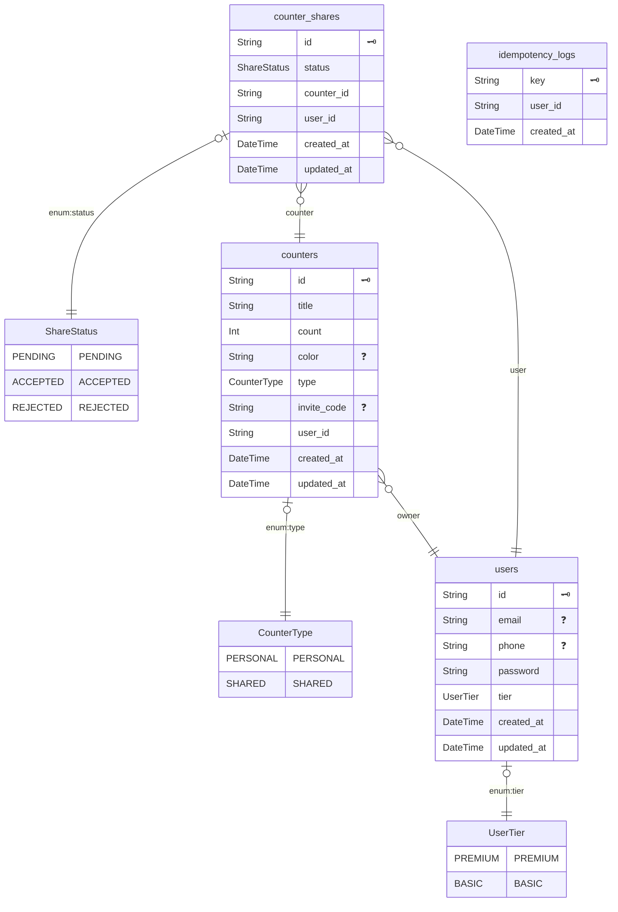

### Entity Relationship Diagram

```mermaid
erDiagram

CounterType {
  PERSONAL PERSONAL
  SHARED SHARED
}
    
ShareStatus {
  PENDING PENDING
  ACCEPTED ACCEPTED
  REJECTED REJECTED
}

UserTier {
  PREMIUM PREMIUM
  BASIC BASIC
}
    
"counters" {
  String id "🗝️"
  String title 
  Int count 
  String color "❓"
  CounterType type 
  String invite_code "❓"
  String user_id 
  DateTime created_at 
  DateTime updated_at 
}
  

"counter_shares" {
  String id "🗝️"
  ShareStatus status 
  String counter_id 
  String user_id 
  DateTime created_at 
  DateTime updated_at 
}
  
"idempotency_logs" {
  String key "🗝️"
  String user_id 
  DateTime created_at 
}

"users" {
  String id "🗝️"
  String email "❓"
  String phone "❓"
  String password 
  UserTier tier 
  DateTime created_at 
  DateTime updated_at 
}

"counters" |o--|| "CounterType" : "enum:type"
"counters" }o--|| users : "owner"
"counter_shares" |o--|| "ShareStatus" : "enum:status"
"counter_shares" }o--|| counters : "counter"
"counter_shares" }o--|| users : "user"
"users" |o--|| "UserTier" : "enum:tier"
```
