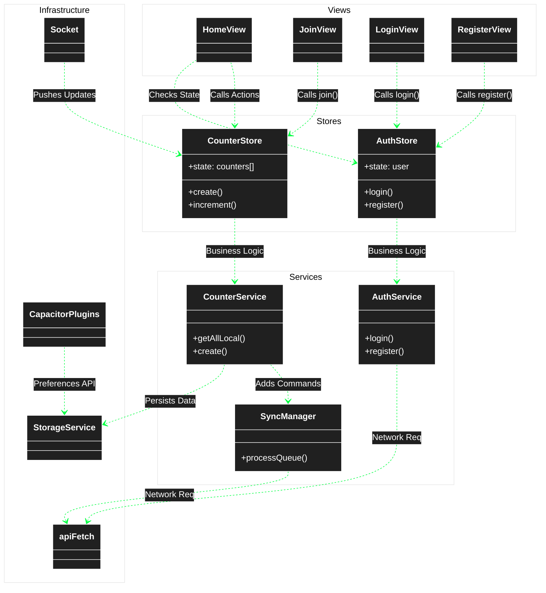

### Client Side Data Flow

```mermaid
%%{
  init: {
    'theme': 'base',
    'themeVariables': {
      'primaryColor': '#202020',
      'primaryTextColor': '#fff',
      'primaryBorderColor': '#ffffff',
      'lineColor': '#00ff41',
      'secondaryColor': '#006100',
      'tertiaryColor': '#fff',
      'noteBkgColor': '#333', 
      'noteTextColor': '#fff',
      'noteBorderColor': '#fff'
    }
  }
}%%

classDiagram
    direction TB

    namespace Views {
        class HomeView
        class JoinView
        class LoginView
        class RegisterView
    }

    namespace Stores {
        class CounterStore {
            +state: counters[]
            +create()
            +increment()
        }
        class AuthStore {
            +state: user
            +login()
            +register()
        }
    }

    namespace Services {
        class CounterService {
            +getAllLocal()
            +create()
        }
        class AuthService {
            +login()
            +register()
        }
        class SyncManager {
            +processQueue()
        }
    }

    namespace Infrastructure {
        class apiFetch
        class Socket
        class StorageService
        class CapacitorPlugins
    }

    %% Relationships
    HomeView ..> CounterStore : Calls Actions
    HomeView ..> AuthStore : Checks State
    JoinView ..> CounterStore : Calls join()
    
    LoginView ..> AuthStore : Calls login()
    RegisterView ..> AuthStore : Calls register()

    CounterStore ..> CounterService : Business Logic
    AuthStore ..> AuthService : Business Logic

    CounterService ..> SyncManager : Adds Commands
    CounterService ..> StorageService : Persists Data
    
    SyncManager ..> apiFetch : Network Req
    AuthService ..> apiFetch : Network Req
    
    Socket ..> CounterStore : Pushes Updates
    CapacitorPlugins ..> StorageService : Preferences API
```
