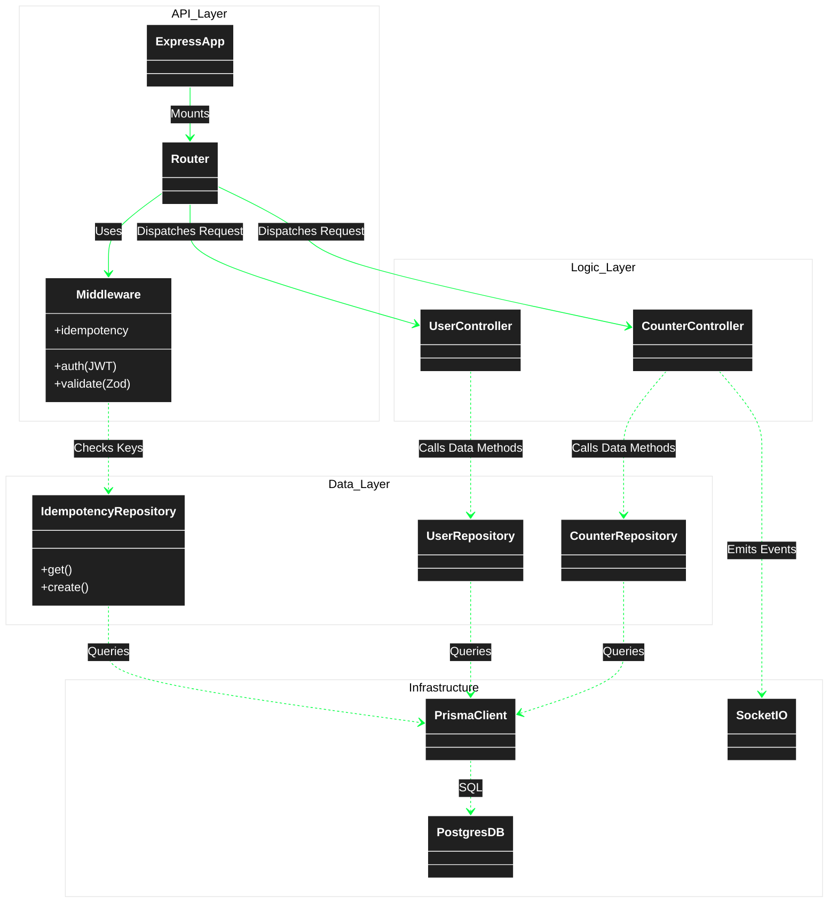

### Server Side Data Flow

```mermaid
%%{
  init: {
    'theme': 'base',
    'themeVariables': {
      'primaryColor': '#202020',
      'primaryTextColor': '#fff',
      'primaryBorderColor': '#ffffff',
      'lineColor': '#00ff41',
      'secondaryColor': '#006100',
      'tertiaryColor': '#fff',
      'noteBkgColor': '#333', 
      'noteTextColor': '#fff',
      'noteBorderColor': '#fff'
    }
  }
}%%


classDiagram
    direction TB

    namespace API_Layer {
        class ExpressApp
        class Router
        class Middleware {
            +auth (JWT)
            +validate (Zod)
            +idempotency
        }
    }

    namespace Logic_Layer {
        class CounterController
        class UserController
    }

    namespace Data_Layer {
        class CounterRepository
        class UserRepository
        class IdempotencyRepository {
            +get()
            +create()
        }
    }

    namespace Infrastructure {
        class PrismaClient
        class SocketIO
        class PostgresDB
    }

    %% Flow
    ExpressApp --> Router : Mounts
    Router --> Middleware : Uses
    Router --> CounterController : Dispatches Request
    Router --> UserController : Dispatches Request

    %% The Update: Middleware calls Repository
    Middleware ..> IdempotencyRepository : Checks Keys

    CounterController ..> CounterRepository : Calls Data Methods
    UserController ..> UserRepository : Calls Data Methods
    
    CounterController ..> SocketIO : Emits Events

    CounterRepository ..> PrismaClient : Queries
    UserRepository ..> PrismaClient : Queries
    IdempotencyRepository ..> PrismaClient : Queries
    
    PrismaClient ..> PostgresDB : SQL
```
