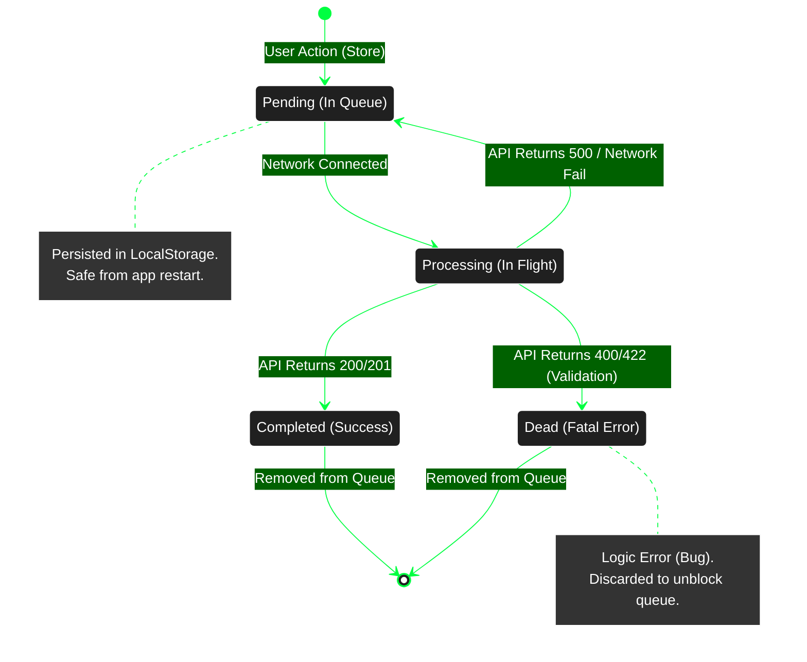

### Mutation Command Lifecycle

```mermaid
%%{
  init: {
    'theme': 'base',
    'themeVariables': {
      'primaryColor': '#202020',
      'primaryTextColor': '#fff',
      'primaryBorderColor': '#ffffff',
      'lineColor': '#00ff41',
      'secondaryColor': '#006100',
      'tertiaryColor': '#fff',
      'noteBkgColor': '#333', 
      'noteTextColor': '#fff',
      'noteBorderColor': '#fff'
    }
  }
}%%

stateDiagram-v2
    [*] --> Pending: User Action (Store)
    
    state "Pending (In Queue)" as Pending
    state "Processing (In Flight)" as Processing
    state "Completed (Success)" as Completed
    state "Dead (Fatal Error)" as Dead

    Pending --> Processing: Network Connected
    
    Processing --> Completed: API Returns 200/201
    Processing --> Pending: API Returns 500 / Network Fail
    Processing --> Dead: API Returns 400/422 (Validation)

    Completed --> [*]: Removed from Queue
    Dead --> [*]: Removed from Queue
    
    note right of Pending
        Persisted in LocalStorage.
        Safe from app restart.
    end note

    note right of Dead
        Logic Error (Bug).
        Discarded to unblock queue.
    end note
```
