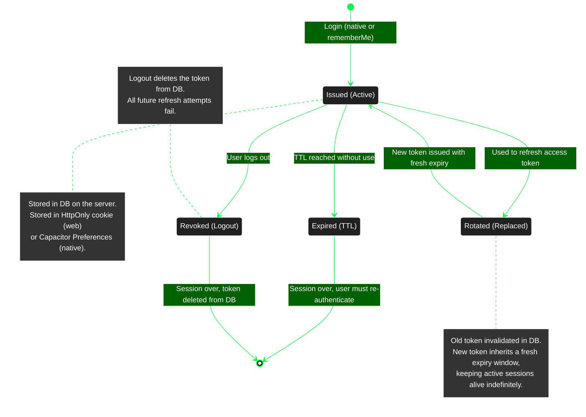

### Refresh Token Lifecycle

```mermaid
%%{
  init: {
    'theme': 'base',
    'themeVariables': {
      'primaryColor': '#202020',
      'primaryTextColor': '#fff',
      'primaryBorderColor': '#ffffff',
      'lineColor': '#00ff41',
      'secondaryColor': '#006100',
      'tertiaryColor': '#fff',
      'noteBkgColor': '#333', 
      'noteTextColor': '#fff',
      'noteBorderColor': '#fff'
    }
  }
}%%

stateDiagram-v2
    [*] --> Issued: Login (native or rememberMe)
    
    state "Issued (Active)" as Issued
    state "Rotated (Replaced)" as Rotated
    state "Expired (TTL)" as Expired
    state "Revoked (Logout)" as Revoked

    Issued --> Rotated: Used to refresh access token
    Rotated --> Issued: New token issued with fresh expiry

    Issued --> Expired: TTL reached without use
    Issued --> Revoked: User logs out

    Expired --> [*]: Session over, user must re-authenticate
    Revoked --> [*]: Session over, token deleted from DB

    note right of Issued
        Stored in DB on the server.
        Stored in HttpOnly cookie (web)
        or Capacitor Preferences (native).
    end note

    note right of Rotated
        Old token invalidated in DB.
        New token inherits a fresh expiry window,
        keeping active sessions alive indefinitely.
    end note

    note left of Revoked
        Logout deletes the token from DB.
        All future refresh attempts fail.
    end note
```
