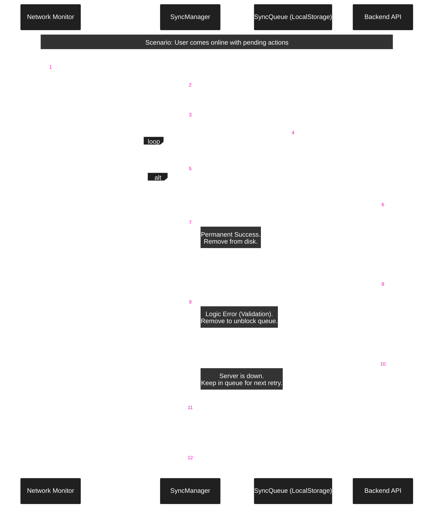

### Background Sync Loop


```mermaid
%%{
  init: {
    'theme': 'base',
    'themeVariables': {
      'primaryColor': '#202020',
      'primaryTextColor': '#fff',
      'primaryBorderColor': '#ffffff',
      'lineColor': '#00ff41',
      'secondaryColor': '#006100',
      'tertiaryColor': '#fff',
      'noteBkgColor': '#333', 
      'noteTextColor': '#fff',
      'noteBorderColor': '#fff'
    }
  }
}%%

sequenceDiagram
    autonumber
    participant Net as Network Monitor
    participant Manager as SyncManager
    participant Queue as SyncQueue (LocalStorage)
    participant API as Backend API

    Note over Net, API: Scenario: User comes online with pending actions

    Net->>Manager: Event: 'networkStatusChange' (Connected)
    Manager->>Manager: processQueue()
    
    Manager->>Queue: getQueue()
    Queue-->>Manager: Returns [Cmd1, Cmd2]

    loop For Each Command
        Manager->>API: Execute Command (Cmd1)
        
        alt Success (200/201)
            API-->>Manager: 200 OK
            Manager->>Queue: removeCommand(Cmd1)
            Note right of Manager: Permanent Success.<br/>Remove from disk.
            
        else Fatal Error (400/422)
            API-->>Manager: 400 Bad Request
            Manager->>Queue: removeCommand(Cmd1)
            Note right of Manager: Logic Error (Validation).<br/>Remove to unblock queue.
            
        else Temporary Error (500/Network)
            API-->>Manager: 500 Server Error
            Note right of Manager: Server is down.<br/>Keep in queue for next retry.
            Manager-->>Manager: Stop Processing (Break Loop)
        end
    end
    
    Manager-->>Manager: isSyncing = false
```
```
