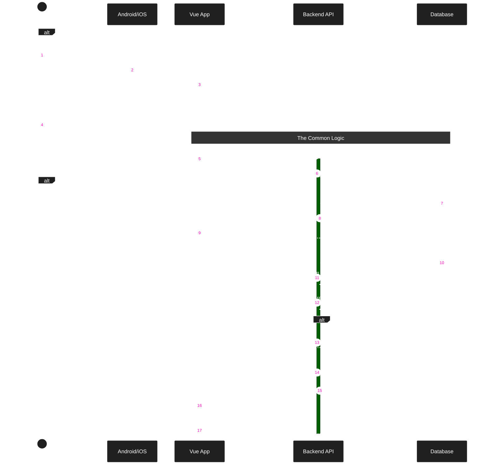

### Join Shared Counter


```mermaid
%%{
  init: {
    'theme': 'base',
    'themeVariables': {
      'primaryColor': '#202020',
      'primaryTextColor': '#fff',
      'primaryBorderColor': '#ffffff',
      'lineColor': '#00ff41',
      'secondaryColor': '#006100',
      'tertiaryColor': '#fff',
      'noteBkgColor': '#333', 
      'noteTextColor': '#fff',
      'noteBorderColor': '#fff'
    }
  }
}%%

sequenceDiagram
    autonumber
    actor User
    participant OS as Android/iOS
    participant App as Vue App
    participant API as Backend API
    participant DB as Database

    alt Entry Point A: Deep Link
        User->>OS: Click "tally://join?code=XYZ"
        OS->>App: Event: appUrlOpen
        App->>App: Parse Code "XYZ"
    else Entry Point B: Web / Manual
        User->>App: Visit "/join?code=XYZ"
    end

    Note over App, DB: The Common Logic

    App->>API: POST /counters/join { inviteCode: "XYZ" }
    
    activate API
    API->>DB: Find Counter by Code
    
    alt Invalid Code
        DB-->>API: Null
        API-->>App: 404 Not Found
        App-->>User: Show Error Toast
    else Valid Code
        DB-->>API: Counter Data
        
        API->>API: Check 1: Am I the Owner?
        API->>API: Check 2: Already Joined?
        
        alt New Share
            API->>DB: INSERT CounterShare (Status: ACCEPTED)
        else Re-Joining (Was Rejected)
            API->>DB: UPDATE CounterShare (Status: ACCEPTED)
        end
        
        API-->>App: 201 Created (+ Counter Data)
        App->>App: Add to Store
        App-->>User: Redirect to Home
    end
    deactivate API
```
```
