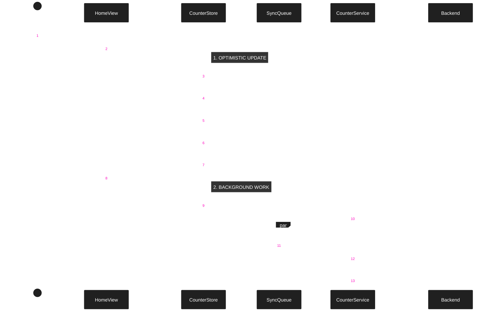

### Offline/Optimistic Counter Creation

```mermaid
%%{
  init: {
    'theme': 'base',
    'themeVariables': {
      'primaryColor': '#202020',
      'primaryTextColor': '#fff',
      'primaryBorderColor': '#ffffff',
      'lineColor': '#00ff41',
      'secondaryColor': '#006100',
      'tertiaryColor': '#fff',
      'noteBkgColor': '#333', 
      'noteTextColor': '#fff',
      'noteBorderColor': '#fff'
    }
  }
}%%

sequenceDiagram
    autonumber
    actor User
    participant View as HomeView
    participant Store as CounterStore
    participant Queue as SyncQueue
    participant Svc as CounterService
    participant API as Backend

    User->>View: Click "Create Counter"
    View->>Store: createCounter("My Title", "SHARED")
    
    Note right of Store: 1. OPTIMISTIC UPDATE
    Store->>Store: Generate UUID (crypto.randomUUID)
    Store->>Store: Generate InviteCode (Local)
    Store->>Store: Push to local array
    Store->>Store: saveState() (Persist to Disk)
    
    Store-->>View: Return Success (Instant)
    View-->>User: Show new counter in list
    
    Note right of Store: 2. BACKGROUND WORK
    Store->>Svc: Service.create(counter)
    Svc->>Queue: Add "CREATE" Command
    
    par Async Sync
        Queue-->>Svc: Command Queued
        Svc->>Svc: Trigger SyncManager
        Svc->>API: POST /counters (Payload + InviteCode)
    end
```
