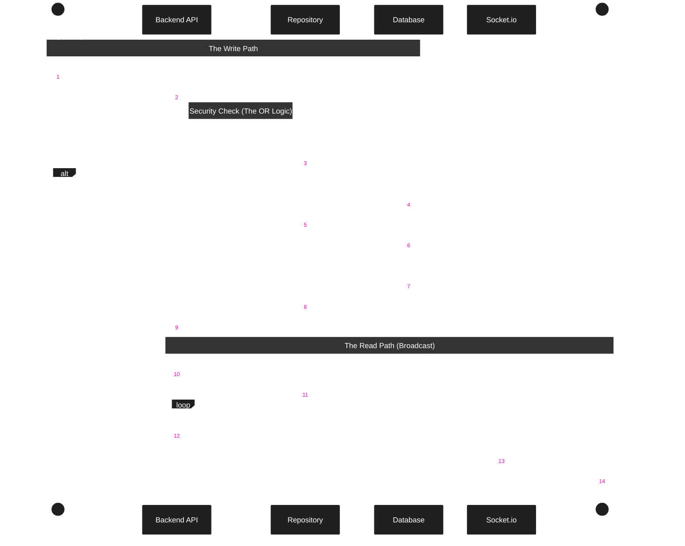

### Real-Time Shared Counter Increment

```mermaid
%%{
  init: {
    'theme': 'base',
    'themeVariables': {
      'primaryColor': '#202020',
      'primaryTextColor': '#fff',
      'primaryBorderColor': '#ffffff',
      'lineColor': '#00ff41',
      'secondaryColor': '#006100',
      'tertiaryColor': '#fff',
      'noteBkgColor': '#333', 
      'noteTextColor': '#fff',
      'noteBorderColor': '#fff'
    }
  }
}%%

sequenceDiagram
    autonumber
    actor Owner as User A (Owner)
    participant API as Backend API
    participant Repo as Repository
    participant DB as Database
    participant Socket as Socket.io
    actor Viewer as User B (Shared)

    Note over Owner, DB: The Write Path
    Owner->>API: PUT /increment (Amount: 1)
    
    API->>Repo: increment({ counterId, userId })
    
    Note right of API: Security Check (The OR Logic)
    Repo->>DB: Find Counter where:<br/>1. User is Owner<br/>OR<br/>2. Share is ACCEPTED
    
    alt Permission Granted
        DB-->>Repo: Counter Found
        Repo->>DB: Update count
        DB-->>API: Updated Counter Data
    else Permission Denied
        DB-->>Repo: Null
        Repo-->>API: Null
        API-->>Owner: 404/403 Error
    end

    Note over API, Viewer: The Read Path (Broadcast)
    
    API->>Repo: getParticipants(counterId)
    Repo-->>API: Returns [OwnerID, ViewerID]
    
    loop For Each Participant
        API->>Socket: io.to(UserID).emit('counter-update')
    end
    
    Socket-->>Viewer: Event: 'counter-update'
    Viewer->>Viewer: Store Updates State (UI Refreshes)

```
